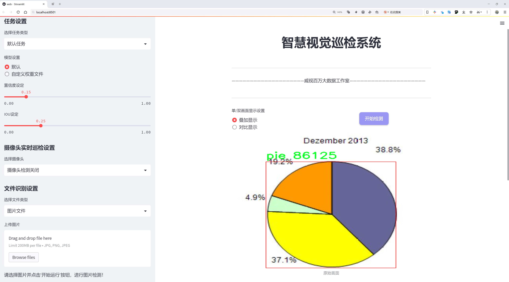
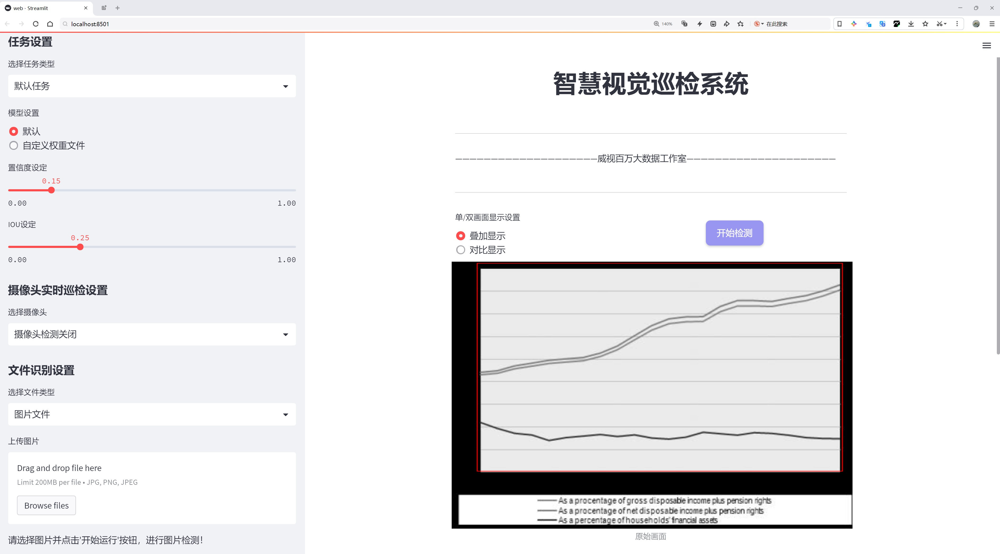
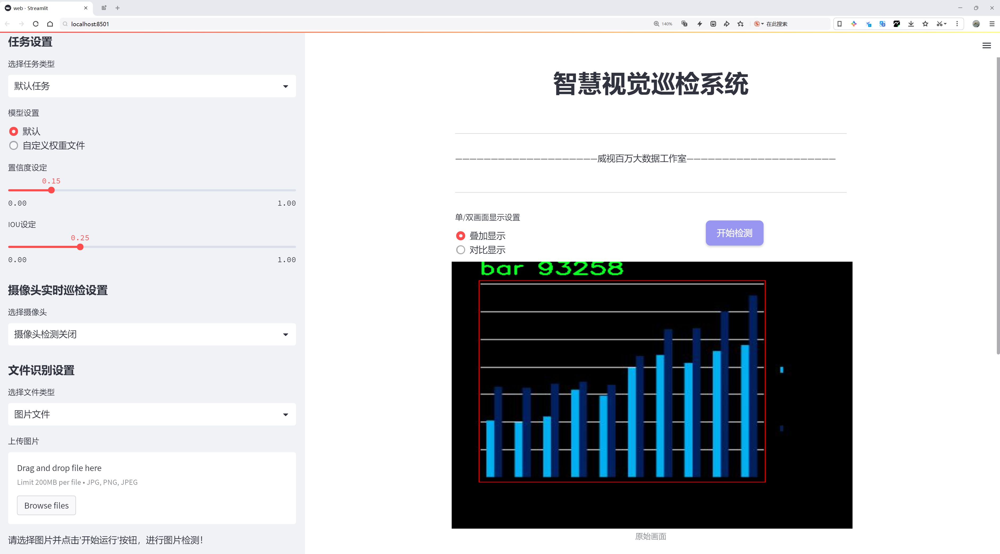
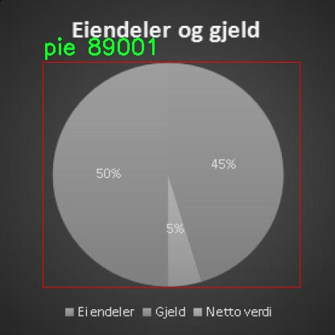
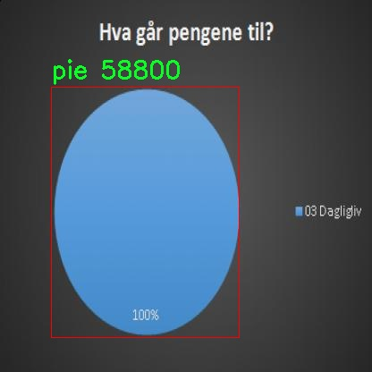
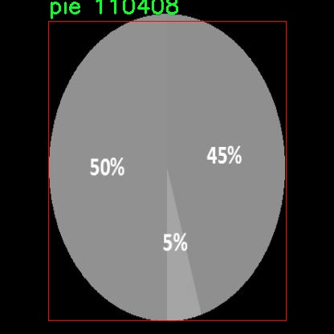
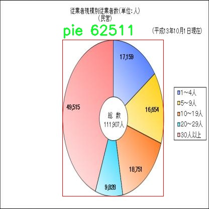
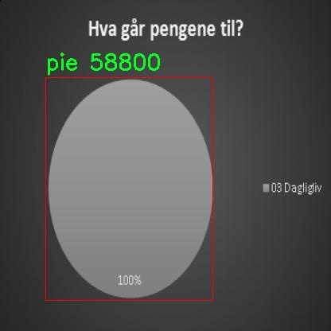

# 图表类型识别检测系统源码分享
 # [一条龙教学YOLOV8标注好的数据集一键训练_70+全套改进创新点发刊_Web前端展示]

### 1.研究背景与意义

项目参考[AAAI Association for the Advancement of Artificial Intelligence](https://gitee.com/qunshansj/projects)

项目来源[AACV Association for the Advancement of Computer Vision](https://gitee.com/qunmasj/projects)

研究背景与意义

随着信息技术的迅猛发展，数据可视化已成为现代信息传播和分析的重要手段。图表作为数据可视化的主要形式之一，广泛应用于各个领域，包括商业、科学研究、教育等。有效的图表识别不仅能够提高信息获取的效率，还能帮助用户更好地理解和分析数据。然而，现有的图表识别技术仍面临着诸多挑战，如图表类型多样性、图表结构复杂性以及背景干扰等问题。因此，开发一种高效、准确的图表类型识别系统显得尤为重要。

本研究基于改进的YOLOv8（You Only Look Once version 8）模型，旨在构建一个高效的图表类型识别系统。YOLO系列模型以其快速的检测速度和较高的准确率而受到广泛关注，尤其适合实时目标检测任务。通过对YOLOv8模型的改进，我们希望能够进一步提升其在图表类型识别中的性能，特别是在处理复杂背景和多样化图表类型时的鲁棒性。

本研究所使用的数据集包含2934张图像，涵盖了三种主要的图表类型：柱状图（bar）、折线图（line）和饼图（pie）。这些图表类型在实际应用中非常常见，各自具有独特的视觉特征和信息传达方式。通过对这些图表进行深入分析和学习，模型能够更好地理解不同图表类型的结构和特征，从而实现高效的分类和识别。

在当前的研究背景下，图表类型识别不仅是计算机视觉领域的一个重要研究方向，也是数据科学和人工智能领域的一个热点问题。随着大数据时代的到来，海量数据的可视化需求日益增加，图表识别技术的进步将直接推动数据分析和决策支持系统的发展。因此，构建一个基于改进YOLOv8的图表类型识别系统，不仅具有重要的学术价值，还有助于实际应用中提高数据处理的效率和准确性。

此外，本研究的意义还体现在以下几个方面：首先，通过对YOLOv8模型的改进，我们可以探索深度学习在图表识别中的新应用，推动计算机视觉技术的发展。其次，研究成果将为相关领域的研究者提供一个高效的工具，促进图表识别技术的普及和应用。最后，随着图表类型识别技术的成熟，未来可以扩展到更多复杂的数据可视化形式，如复合图表、动态图表等，进一步提升信息传递的效率和准确性。

综上所述，基于改进YOLOv8的图表类型识别系统的研究，不仅能够填补现有技术的空白，还将为未来的数据可视化和分析提供重要的技术支持，具有重要的理论和实践意义。

### 2.图片演示







##### 注意：由于此博客编辑较早，上面“2.图片演示”和“3.视频演示”展示的系统图片或者视频可能为老版本，新版本在老版本的基础上升级如下：（实际效果以升级的新版本为准）

  （1）适配了YOLOV8的“目标检测”模型和“实例分割”模型，通过加载相应的权重（.pt）文件即可自适应加载模型。

  （2）支持“图片识别”、“视频识别”、“摄像头实时识别”三种识别模式。

  （3）支持“图片识别”、“视频识别”、“摄像头实时识别”三种识别结果保存导出，解决手动导出（容易卡顿出现爆内存）存在的问题，识别完自动保存结果并导出到tempDir中。

  （4）支持Web前端系统中的标题、背景图等自定义修改，后面提供修改教程。

  另外本项目提供训练的数据集和训练教程,暂不提供权重文件（best.pt）,需要您按照教程进行训练后实现图片演示和Web前端界面演示的效果。

### 3.视频演示

[3.1 视频演示](https://www.bilibili.com/video/BV1wh48eEE8r/)

### 4.数据集信息展示

##### 4.1 本项目数据集详细数据（类别数＆类别名）

nc: 3
names: ['bar', 'line', 'pie']


##### 4.2 本项目数据集信息介绍

数据集信息展示

在现代数据科学和机器学习的研究中，数据集的构建与选择是至关重要的一环。本研究所使用的数据集名为“Chart-Datasets”，专门用于训练和改进YOLOv8的图表类型识别系统。该数据集的设计旨在提升模型在不同类型图表识别任务中的准确性和鲁棒性，尤其是在处理多样化的图表格式时。数据集的类别数量为3，涵盖了常见的图表类型：条形图（bar）、折线图（line）和饼图（pie）。这些类别的选择不仅反映了数据可视化领域的基本构成，也为模型的训练提供了丰富的样本。

在“Chart-Datasets”中，条形图作为一种直观且易于理解的数据展示方式，广泛应用于比较不同类别的数据。该类别的样本包含多种风格和布局的条形图，确保模型能够学习到不同条形图的特征，例如条形的宽度、颜色、排列方式等。此外，条形图的样本中还包含了多种数据标注形式，进一步增强了模型的泛化能力。

折线图则是另一种重要的图表类型，常用于展示数据随时间变化的趋势。在“Chart-Datasets”中，折线图的样本涵盖了多条线的情况，能够有效地展示多组数据之间的关系。样本中不仅包括了简单的单线折线图，还包含了复杂的多线折线图，模型在训练过程中能够学习到如何识别不同颜色和样式的线条，以及它们在图表中的相对位置和交互关系。

饼图作为一种展示比例关系的图表类型，能够清晰地表达各部分与整体之间的关系。在“Chart-Datasets”中，饼图的样本同样丰富多样，涵盖了不同的切片数量、颜色和标签形式。这些样本的多样性使得模型能够学习到如何识别饼图中的各个部分，以及如何处理可能出现的重叠和遮挡情况。

通过对这三种图表类型的深入分析和样本收集，“Chart-Datasets”不仅为YOLOv8模型的训练提供了坚实的基础，也为后续的图表类型识别研究奠定了良好的数据支持。数据集的构建过程中，特别注重样本的多样性和代表性，以确保模型在实际应用中能够应对各种复杂情况。

总之，“Chart-Datasets”作为一个专门为图表类型识别而设计的数据集，凭借其丰富的样本和多样的类别，必将为改进YOLOv8模型的性能提供强有力的支持。通过对条形图、折线图和饼图的深入学习，模型将能够在实际应用中更准确地识别和分类不同类型的图表，为数据分析和可视化领域的研究提供更为可靠的技术保障。











### 5.全套项目环境部署视频教程（零基础手把手教学）

[5.1 环境部署教程链接（零基础手把手教学）](https://www.ixigua.com/7404473917358506534?logTag=c807d0cbc21c0ef59de5)


[5.2 安装Python虚拟环境创建和依赖库安装视频教程链接（零基础手把手教学）](https://www.ixigua.com/7404474678003106304?logTag=1f1041108cd1f708b01a)

### 6.手把手YOLOV8训练视频教程（零基础小白有手就能学会）

[6.1 手把手YOLOV8训练视频教程（零基础小白有手就能学会）](https://www.ixigua.com/7404477157818401292?logTag=d31a2dfd1983c9668658)

### 7.70+种全套YOLOV8创新点代码加载调参视频教程（一键加载写好的改进模型的配置文件）

[7.1 70+种全套YOLOV8创新点代码加载调参视频教程（一键加载写好的改进模型的配置文件）](https://www.ixigua.com/7404478314661806627?logTag=29066f8288e3f4eea3a4)

### 8.70+种全套YOLOV8创新点原理讲解（非科班也可以轻松写刊发刊，V10版本正在科研待更新）

由于篇幅限制，每个创新点的具体原理讲解就不一一展开，具体见下列网址中的创新点对应子项目的技术原理博客网址【Blog】：


[8.1 70+种全套YOLOV8创新点原理讲解链接](https://gitee.com/qunmasj/good)

### 9.系统功能展示（检测对象为举例，实际内容以本项目数据集为准）

图9.1.系统支持检测结果表格显示

  图9.2.系统支持置信度和IOU阈值手动调节

  图9.3.系统支持自定义加载权重文件best.pt(需要你通过步骤5中训练获得)

  图9.4.系统支持摄像头实时识别

  图9.5.系统支持图片识别

  图9.6.系统支持视频识别

  图9.7.系统支持识别结果文件自动保存

  图9.8.系统支持Excel导出检测结果数据


### 10.原始YOLOV8算法原理

原始YOLOv8算法原理

YOLOv8（You Only Look Once version 8）是目标检测领域的最新进展，其设计理念在于实现快速、准确的目标检测，同时具备高度的灵活性和可扩展性。作为YOLO系列的第八个版本，YOLOv8在前几个版本的基础上进行了显著的改进，采用了全新的网络架构和训练策略，使其在处理复杂场景时表现出色。YOLOv8的核心结构由三部分组成：Backbone、Neck和Head，这三部分共同协作，形成了一个高效的目标检测系统。

在YOLOv8的Backbone部分，采用了一系列精心设计的卷积层和反卷积层，旨在提取输入图像的深层特征。为了提高特征提取的效率和效果，YOLOv8引入了残差连接和瓶颈结构，这些设计不仅减小了网络的复杂度，还提升了模型的性能。具体而言，Backbone部分由五个CBS模块、四个C2f模块和一个快速空间金字塔池化（SPPF）模块构成。CBS模块负责基本的卷积操作，结合批归一化和SiLU激活函数，增强了特征的表达能力。C2f模块则借鉴了YOLOv7中的E-ELAN结构，通过跨层分支连接，改善了梯度流动，进而提升了模型的检测精度。SPPF模块的引入使得网络能够有效处理多尺度特征，通过三个最大池化层的组合，增强了特征的抽象能力，为后续的特征融合打下了坚实的基础。

接下来是Neck部分，它的主要功能是将来自Backbone不同阶段的特征图进行融合，以便更好地捕捉不同尺度目标的信息。YOLOv8采用了多尺度特征融合技术，利用FPNS（Feature Pyramid Network）和PAN（Path Aggregation Network）结构，增强了网络对多尺度目标的检测能力。通过这种特征融合，YOLOv8能够有效整合来自不同层次的特征信息，从而提高了目标检测的性能和鲁棒性。Neck部分的设计理念在于使得网络能够更好地理解图像中的上下文信息，进而提升目标检测的准确性。

最后，YOLOv8的Head部分负责最终的目标检测和分类任务。该部分设有三个解耦检测头，分别用于处理不同尺寸的信息。每个检测头包含一系列卷积层和反卷积层，通过这些层的组合，YOLOv8能够生成高质量的检测结果。解耦设计的引入使得模型在回归和分类任务上能够独立优化，进而提升了整体的检测性能。YOLOv8在Head部分的创新使得其在复杂场景下的目标检测能力得到了显著提升。

在YOLOv8的设计中，模型的深度和宽度可以通过depth_factor和width_factor进行灵活调整。这种灵活性使得用户能够根据具体的应用需求，选择合适的模型结构，以达到最佳的性能表现。YOLOv8的五种网络结构（YOLOv8n、YOLOv8s、YOLOv8m、YOLOv8l和YOLOv8x）分别在Backbone的层数和残差块的数量上有所不同，用户可以根据自己的计算资源和精度需求进行选择。

此外，YOLOv8还具备原生支持自定义数据集的能力，这使得用户在进行特定任务时能够更加方便地进行模型训练和调整。与以往版本相比，YOLOv8在推理速度和精度上都有了显著提升，这使得其在实际应用中表现得更加出色。无论是在实时视频监控、自动驾驶、无人机图像分析，还是在工业检测等领域，YOLOv8都展现出了其强大的应用潜力。

总的来说，YOLOv8通过创新的网络结构和灵活的模型设置，成功地实现了目标检测领域的又一次飞跃。其在特征提取、特征融合和目标检测等多个环节的优化，使得YOLOv8成为了当前业界最流行和成功的目标检测算法之一。随着YOLOv8的广泛应用，未来在目标检测的研究和实践中，YOLOv8无疑将继续发挥重要的作用。


### 11.项目核心源码讲解（再也不用担心看不懂代码逻辑）

#### 11.1 ui.py

以下是经过简化和注释的核心代码部分：

```python
import sys
import subprocess

def run_script(script_path):
    """
    使用当前 Python 环境运行指定的脚本。

    Args:
        script_path (str): 要运行的脚本路径
    """
    # 获取当前 Python 解释器的路径
    python_path = sys.executable

    # 构建运行命令，使用 streamlit 运行指定的脚本
    command = f'"{python_path}" -m streamlit run "{script_path}"'

    # 执行命令
    result = subprocess.run(command, shell=True)
    # 检查命令执行结果，如果返回码不为0，则表示出错
    if result.returncode != 0:
        print("脚本运行出错。")

# 程序入口
if __name__ == "__main__":
    # 指定要运行的脚本路径
    script_path = "web.py"  # 这里可以直接指定脚本名，假设它在当前目录下

    # 调用函数运行脚本
    run_script(script_path)
```

### 代码注释说明：
1. **导入模块**：
   - `sys`：用于获取当前 Python 解释器的路径。
   - `subprocess`：用于执行外部命令。

2. **`run_script` 函数**：
   - 接受一个参数 `script_path`，表示要运行的 Python 脚本的路径。
   - 使用 `sys.executable` 获取当前 Python 解释器的路径。
   - 构建一个命令字符串，使用 `streamlit` 运行指定的脚本。
   - 使用 `subprocess.run` 执行构建的命令，并检查返回码以判断脚本是否成功运行。

3. **程序入口**：
   - 使用 `if __name__ == "__main__":` 确保只有在直接运行该脚本时才会执行以下代码。
   - 指定要运行的脚本路径（这里假设脚本 `web.py` 在当前目录下）。
   - 调用 `run_script` 函数来执行指定的脚本。

这个程序文件名为 `ui.py`，其主要功能是运行一个指定的 Python 脚本，具体是通过 Streamlit 框架来启动一个 Web 应用。

首先，文件导入了几个必要的模块，包括 `sys`、`os` 和 `subprocess`。其中，`sys` 模块用于访问与 Python 解释器相关的变量和函数，`os` 模块提供了与操作系统交互的功能，而 `subprocess` 模块则用于创建新进程、连接到它们的输入/输出/错误管道，并获取它们的返回码。

接下来，程序定义了一个名为 `run_script` 的函数，该函数接受一个参数 `script_path`，表示要运行的脚本的路径。在函数内部，首先获取当前 Python 解释器的路径，使用 `sys.executable` 来实现。然后，构建一个命令字符串，该命令使用当前的 Python 解释器和 Streamlit 模块来运行指定的脚本。命令的格式为 `"{python_path}" -m streamlit run "{script_path}"`，其中 `python_path` 是当前 Python 解释器的路径，`script_path` 是要运行的脚本路径。

接着，使用 `subprocess.run` 方法执行构建好的命令。这个方法会在新的进程中运行命令，并等待其完成。运行结束后，检查返回码 `result.returncode`，如果返回码不为 0，表示脚本运行出错，程序会打印出“脚本运行出错。”的提示信息。

在文件的最后部分，使用 `if __name__ == "__main__":` 来确保只有在直接运行该脚本时才会执行后面的代码。在这里，指定了要运行的脚本路径为 `web.py`，这个路径是通过调用 `abs_path` 函数来获取的，该函数可能用于将相对路径转换为绝对路径。最后，调用 `run_script` 函数来运行指定的脚本。

总的来说，这个程序的主要作用是通过 Streamlit 框架来启动一个 Web 应用，具体的应用逻辑则在 `web.py` 脚本中实现。

#### 11.2 code\ultralytics\data\__init__.py

以下是保留的核心代码部分，并附上详细的中文注释：

```python
# 导入基础数据集类
from .base import BaseDataset
# 导入构建数据加载器和YOLO数据集的函数
from .build import build_dataloader, build_yolo_dataset, load_inference_source
# 导入不同类型的数据集类
from .dataset import ClassificationDataset, SemanticDataset, YOLODataset

# 定义模块的公开接口，包含可供外部使用的类和函数
__all__ = (
    "BaseDataset",            # 基础数据集类
    "ClassificationDataset",  # 分类数据集类
    "SemanticDataset",        # 语义分割数据集类
    "YOLODataset",            # YOLO目标检测数据集类
    "build_yolo_dataset",     # 构建YOLO数据集的函数
    "build_dataloader",       # 构建数据加载器的函数
    "load_inference_source",   # 加载推理源的函数
)
```

### 注释说明：
1. **导入模块**：代码中通过`from ... import ...`语句导入了必要的类和函数，这些类和函数用于构建和处理不同类型的数据集。
2. **公开接口**：`__all__`变量定义了模块的公开接口，指定了哪些类和函数可以被外部导入和使用。这有助于管理模块的可见性，避免不必要的内部实现细节暴露给用户。

这个程序文件是Ultralytics YOLO项目中的一个初始化文件，通常用于定义模块的公共接口。在文件的开头，有一个注释说明了该项目的名称（Ultralytics YOLO）以及其使用的许可证类型（AGPL-3.0）。接下来，文件通过相对导入的方式引入了几个重要的组件。

首先，从`.base`模块中导入了`BaseDataset`类，这个类可能是所有数据集类的基类，提供了一些通用的方法和属性。然后，从`.build`模块中导入了三个函数：`build_dataloader`、`build_yolo_dataset`和`load_inference_source`。这些函数的名称暗示它们与数据加载和数据集构建有关，可能用于创建数据加载器和构建YOLO特定的数据集。

接着，从`.dataset`模块中导入了三个具体的数据集类：`ClassificationDataset`、`SemanticDataset`和`YOLODataset`。这些类分别用于处理不同类型的数据集，可能对应于分类任务、语义分割任务和YOLO模型所需的数据集格式。

最后，`__all__`变量定义了该模块的公共接口，列出了可以被外部导入的类和函数。这意味着，当其他模块使用`from ultralytics.data import *`这样的语句时，只会导入`__all__`中列出的名称，从而控制了模块的可见性和使用范围。

总体来说，这个文件的主要功能是组织和导出与数据集相关的类和函数，为YOLO模型的训练和推理提供必要的数据处理工具。

#### 11.3 70+种YOLOv8算法改进源码大全和调试加载训练教程（非必要）\ultralytics\nn\backbone\lsknet.py

以下是代码中最核心的部分，并添加了详细的中文注释：

```python
import torch
import torch.nn as nn
from functools import partial

class Mlp(nn.Module):
    """ 多层感知机（MLP）模块 """
    def __init__(self, in_features, hidden_features=None, out_features=None, act_layer=nn.GELU, drop=0.):
        super().__init__()
        out_features = out_features or in_features  # 输出特征数默认为输入特征数
        hidden_features = hidden_features or in_features  # 隐藏层特征数默认为输入特征数
        self.fc1 = nn.Conv2d(in_features, hidden_features, 1)  # 1x1卷积层
        self.dwconv = DWConv(hidden_features)  # 深度卷积层
        self.act = act_layer()  # 激活函数
        self.fc2 = nn.Conv2d(hidden_features, out_features, 1)  # 1x1卷积层
        self.drop = nn.Dropout(drop)  # Dropout层

    def forward(self, x):
        x = self.fc1(x)  # 通过第一个卷积层
        x = self.dwconv(x)  # 通过深度卷积层
        x = self.act(x)  # 激活
        x = self.drop(x)  # Dropout
        x = self.fc2(x)  # 通过第二个卷积层
        x = self.drop(x)  # Dropout
        return x

class Attention(nn.Module):
    """ 注意力模块 """
    def __init__(self, d_model):
        super().__init__()
        self.proj_1 = nn.Conv2d(d_model, d_model, 1)  # 1x1卷积层
        self.activation = nn.GELU()  # 激活函数
        self.spatial_gating_unit = LSKblock(d_model)  # 空间门控单元
        self.proj_2 = nn.Conv2d(d_model, d_model, 1)  # 1x1卷积层

    def forward(self, x):
        shortcut = x.clone()  # 保存输入以便后续残差连接
        x = self.proj_1(x)  # 通过第一个卷积层
        x = self.activation(x)  # 激活
        x = self.spatial_gating_unit(x)  # 通过空间门控单元
        x = self.proj_2(x)  # 通过第二个卷积层
        x = x + shortcut  # 残差连接
        return x

class Block(nn.Module):
    """ 网络的基本块，包含注意力和MLP """
    def __init__(self, dim, mlp_ratio=4., drop=0., drop_path=0., act_layer=nn.GELU):
        super().__init__()
        self.norm1 = nn.BatchNorm2d(dim)  # 第一层归一化
        self.norm2 = nn.BatchNorm2d(dim)  # 第二层归一化
        self.attn = Attention(dim)  # 注意力模块
        self.drop_path = DropPath(drop_path) if drop_path > 0. else nn.Identity()  # 随机深度
        mlp_hidden_dim = int(dim * mlp_ratio)  # MLP隐藏层维度
        self.mlp = Mlp(in_features=dim, hidden_features=mlp_hidden_dim, act_layer=act_layer, drop=drop)  # MLP模块

    def forward(self, x):
        x = x + self.drop_path(self.attn(self.norm1(x)))  # 注意力模块与残差连接
        x = x + self.drop_path(self.mlp(self.norm2(x)))  # MLP模块与残差连接
        return x

class LSKNet(nn.Module):
    """ LSKNet网络结构 """
    def __init__(self, img_size=224, in_chans=3, embed_dims=[64, 128, 256, 512], depths=[3, 4, 6, 3]):
        super().__init__()
        self.num_stages = len(depths)  # 网络阶段数
        for i in range(self.num_stages):
            # 初始化每个阶段的嵌入层和块
            patch_embed = OverlapPatchEmbed(img_size=img_size // (2 ** i), in_chans=in_chans if i == 0 else embed_dims[i - 1], embed_dim=embed_dims[i])
            block = nn.ModuleList([Block(dim=embed_dims[i]) for _ in range(depths[i])])  # 每个阶段的块
            norm = nn.BatchNorm2d(embed_dims[i])  # 归一化层
            setattr(self, f"patch_embed{i + 1}", patch_embed)  # 动态设置属性
            setattr(self, f"block{i + 1}", block)
            setattr(self, f"norm{i + 1}", norm)

    def forward(self, x):
        outs = []
        for i in range(self.num_stages):
            patch_embed = getattr(self, f"patch_embed{i + 1}")
            block = getattr(self, f"block{i + 1}")
            norm = getattr(self, f"norm{i + 1}")
            x, H, W = patch_embed(x)  # 嵌入层
            for blk in block:
                x = blk(x)  # 通过每个块
            x = norm(x)  # 归一化
            outs.append(x)  # 保存输出
        return outs

class DWConv(nn.Module):
    """ 深度卷积模块 """
    def __init__(self, dim=768):
        super(DWConv, self).__init__()
        self.dwconv = nn.Conv2d(dim, dim, 3, 1, 1, bias=True, groups=dim)  # 深度卷积

    def forward(self, x):
        return self.dwconv(x)  # 通过深度卷积

# 创建LSKNet模型的函数
def lsknet_t():
    model = LSKNet(embed_dims=[32, 64, 160, 256], depths=[3, 3, 5, 2])  # 定义模型结构
    return model

if __name__ == '__main__':
    model = lsknet_t()  # 实例化模型
    inputs = torch.randn((1, 3, 640, 640))  # 随机输入
    for i in model(inputs):
        print(i.size())  # 输出每个阶段的输出尺寸
```

### 代码核心部分说明：
1. **Mlp类**：实现了一个多层感知机模块，包含两个1x1卷积层和一个深度卷积层，支持激活函数和Dropout。
2. **Attention类**：实现了一个注意力机制，包含两个1x1卷积层和一个空间门控单元（LSKblock）。
3. **Block类**：将注意力模块和MLP模块结合在一起，形成网络的基本构建块，支持残差连接。
4. **LSKNet类**：定义了整个网络结构，包含多个阶段，每个阶段由嵌入层、多个Block和归一化层组成。
5. **DWConv类**：实现了深度卷积操作，用于特征提取。

该代码的主要目的是构建一个深度学习模型，利用注意力机制和多层感知机来处理图像数据。

这个程序文件定义了一个名为 `lsknet.py` 的神经网络模型，主要用于图像处理任务。它包含多个类和函数，构建了一个复杂的网络结构，使用了深度学习中的一些常见技术。以下是对代码的详细讲解。

首先，文件导入了必要的库，包括 `torch` 和 `torch.nn`，这些是构建和训练神经网络的基础库。还引入了一些辅助函数和类，比如 `DropPath` 和 `to_2tuple`，用于实现特定的功能。

接下来，定义了一个 `Mlp` 类，它是一个多层感知机模块。这个模块包含两个卷积层和一个深度卷积层，使用了激活函数（默认为GELU）和Dropout层。`forward` 方法定义了数据如何通过这个模块进行前向传播。

然后是 `LSKblock` 类，它实现了一个特定的块结构，包含多个卷积层和注意力机制。这个块通过对输入进行卷积操作和空间注意力计算，生成加权后的输出。`forward` 方法中使用了张量的拼接和注意力机制来处理输入数据。

接着，定义了 `Attention` 类，它是一个注意力模块，包含两个卷积层和一个 `LSKblock`。在 `forward` 方法中，输入数据通过卷积和激活函数处理，然后经过注意力机制，最后与输入的短路连接相加。

`Block` 类是网络的基本构建块，包含了归一化层、注意力模块和多层感知机。它通过前向传播方法实现了对输入的处理，结合了层级缩放和随机深度的特性。

`OverlapPatchEmbed` 类负责将输入图像转换为补丁嵌入，使用卷积层进行处理，并进行归一化。

`LSKNet` 类是整个网络的核心，负责构建整个模型的结构。它根据输入的参数初始化多个阶段的补丁嵌入、块和归一化层。`forward` 方法实现了整个网络的前向传播，逐层处理输入数据并输出结果。

`DWConv` 类实现了深度卷积操作，主要用于在 `Mlp` 中。

`update_weight` 函数用于更新模型的权重，确保模型字典中的权重与给定的权重字典匹配。

`lsknet_t` 和 `lsknet_s` 函数分别用于创建不同配置的 `LSKNet` 模型，并可选择加载预训练权重。

最后，在 `__main__` 部分，示例代码展示了如何创建一个 `lsknet_t` 模型并进行前向传播，打印输出的尺寸。

总体来说，这个文件实现了一个复杂的神经网络结构，结合了多种深度学习技术，适用于图像处理任务。通过模块化的设计，代码易于扩展和修改，适合研究和实际应用。

#### 11.4 train.py

以下是经过简化和注释的核心代码部分，主要集中在YOLO模型的训练和数据处理上：

```python
import random
import numpy as np
import torch.nn as nn
from ultralytics.data import build_dataloader, build_yolo_dataset
from ultralytics.engine.trainer import BaseTrainer
from ultralytics.models import yolo
from ultralytics.nn.tasks import DetectionModel
from ultralytics.utils import LOGGER, RANK
from ultralytics.utils.torch_utils import de_parallel, torch_distributed_zero_first

class DetectionTrainer(BaseTrainer):
    """
    扩展自BaseTrainer类，用于基于检测模型的训练。
    """

    def build_dataset(self, img_path, mode="train", batch=None):
        """
        构建YOLO数据集。

        参数:
            img_path (str): 包含图像的文件夹路径。
            mode (str): 模式，可以是'train'或'val'，用户可以为每种模式自定义不同的增强。
            batch (int, optional): 批次大小，适用于'rect'模式。默认为None。
        """
        gs = max(int(de_parallel(self.model).stride.max() if self.model else 0), 32)
        return build_yolo_dataset(self.args, img_path, batch, self.data, mode=mode, rect=mode == "val", stride=gs)

    def get_dataloader(self, dataset_path, batch_size=16, rank=0, mode="train"):
        """构造并返回数据加载器。"""
        assert mode in ["train", "val"]
        with torch_distributed_zero_first(rank):  # 在分布式训练中，确保数据集只初始化一次
            dataset = self.build_dataset(dataset_path, mode, batch_size)
        shuffle = mode == "train"  # 训练模式下打乱数据
        workers = self.args.workers if mode == "train" else self.args.workers * 2
        return build_dataloader(dataset, batch_size, workers, shuffle, rank)  # 返回数据加载器

    def preprocess_batch(self, batch):
        """对一批图像进行预处理，包括缩放和转换为浮点数。"""
        batch["img"] = batch["img"].to(self.device, non_blocking=True).float() / 255  # 将图像转换为浮点数并归一化
        if self.args.multi_scale:  # 如果启用多尺度训练
            imgs = batch["img"]
            sz = (
                random.randrange(self.args.imgsz * 0.5, self.args.imgsz * 1.5 + self.stride)
                // self.stride
                * self.stride
            )  # 随机选择一个新的尺寸
            sf = sz / max(imgs.shape[2:])  # 计算缩放因子
            if sf != 1:
                ns = [
                    math.ceil(x * sf / self.stride) * self.stride for x in imgs.shape[2:]
                ]  # 计算新的形状
                imgs = nn.functional.interpolate(imgs, size=ns, mode="bilinear", align_corners=False)  # 调整图像大小
            batch["img"] = imgs
        return batch

    def get_model(self, cfg=None, weights=None, verbose=True):
        """返回YOLO检测模型。"""
        model = DetectionModel(cfg, nc=self.data["nc"], verbose=verbose and RANK == -1)
        if weights:
            model.load(weights)  # 加载预训练权重
        return model

    def plot_training_samples(self, batch, ni):
        """绘制带有注释的训练样本。"""
        plot_images(
            images=batch["img"],
            batch_idx=batch["batch_idx"],
            cls=batch["cls"].squeeze(-1),
            bboxes=batch["bboxes"],
            paths=batch["im_file"],
            fname=self.save_dir / f"train_batch{ni}.jpg",
            on_plot=self.on_plot,
        )
```

### 代码说明：
1. **类定义**：`DetectionTrainer`类继承自`BaseTrainer`，用于处理YOLO模型的训练。
2. **数据集构建**：`build_dataset`方法根据给定的图像路径和模式构建YOLO数据集，支持训练和验证模式。
3. **数据加载器**：`get_dataloader`方法创建数据加载器，支持分布式训练。
4. **批处理预处理**：`preprocess_batch`方法对输入图像进行归一化和尺寸调整，支持多尺度训练。
5. **模型获取**：`get_model`方法返回YOLO检测模型，并可选择加载预训练权重。
6. **绘制训练样本**：`plot_training_samples`方法用于可视化训练样本及其对应的注释。 

这些核心部分是YOLO模型训练的基础，涵盖了数据处理、模型构建和可视化等关键功能。

这个程序文件 `train.py` 是一个用于训练 YOLO（You Only Look Once）目标检测模型的实现，基于 Ultralytics 的 YOLO 框架。程序主要包含一个名为 `DetectionTrainer` 的类，继承自 `BaseTrainer`，并实现了一系列用于构建数据集、数据加载、预处理、模型设置、训练过程中的损失计算和可视化等功能的方法。

在 `DetectionTrainer` 类中，首先定义了 `build_dataset` 方法，用于构建 YOLO 数据集。该方法接收图像路径、模式（训练或验证）和批量大小作为参数，并根据模型的步幅（stride）来确定数据集的构建方式。

接着，`get_dataloader` 方法用于构建并返回数据加载器。它会根据传入的模式（训练或验证）来决定是否打乱数据，并设置工作线程的数量。此方法还使用了分布式训练的相关功能，以确保数据集只初始化一次。

`preprocess_batch` 方法负责对输入的图像批次进行预处理，包括将图像缩放到适当的大小并转换为浮点数格式。该方法还支持多尺度训练，通过随机选择图像的大小来增强模型的鲁棒性。

`set_model_attributes` 方法用于设置模型的属性，包括类别数量和类别名称等，以确保模型能够正确处理训练数据。

`get_model` 方法用于返回一个 YOLO 检测模型实例，可以选择加载预训练权重。

`get_validator` 方法返回一个用于模型验证的 `DetectionValidator` 实例，以便在训练过程中进行性能评估。

`label_loss_items` 方法用于返回一个包含训练损失项的字典，方便在训练过程中监控模型的表现。

`progress_string` 方法生成一个格式化的字符串，显示训练进度，包括当前的 epoch、GPU 内存使用情况、损失值、实例数量和图像大小等信息。

`plot_training_samples` 方法用于绘制训练样本及其标注，便于可视化训练过程中的数据。

最后，`plot_metrics` 和 `plot_training_labels` 方法分别用于绘制训练过程中的指标和创建带标签的训练图，以便于分析模型的训练效果。

整体而言，这个程序文件实现了 YOLO 模型训练的核心功能，涵盖了数据处理、模型构建、训练过程监控和结果可视化等多个方面，旨在提供一个完整的训练框架。

#### 11.5 70+种YOLOv8算法改进源码大全和调试加载训练教程（非必要）\ultralytics\nn\extra_modules\ops_dcnv3\modules\dcnv3.py


该程序文件实现了DCNv3（Deformable Convolutional Networks v3）模块，主要用于深度学习中的卷积操作，特别是在目标检测和图像分割等任务中。文件中包含多个类和函数，以下是对其主要内容的讲解。

首先，文件引入了一些必要的库，包括PyTorch的核心模块和一些功能模块。接着，定义了两个类`to_channels_first`和`to_channels_last`，它们用于在不同的通道格式之间进行转换。`to_channels_first`将输入的形状从`(N, H, W, C)`转换为`(N, C, H, W)`，而`to_channels_last`则反向转换。

接下来，`build_norm_layer`函数用于构建归一化层，支持批归一化（Batch Normalization）和层归一化（Layer Normalization），并根据输入和输出格式进行通道格式的转换。`build_act_layer`函数则用于构建激活函数层，支持ReLU、SiLU和GELU等激活函数。

`_is_power_of_2`函数用于检查一个数是否是2的幂，这在设置DCNv3模块的通道数时非常重要，因为某些CUDA实现对2的幂的维度更加高效。

`CenterFeatureScaleModule`类实现了中心特征缩放的功能，通过线性变换和sigmoid激活函数生成中心特征缩放的权重。

`DCNv3_pytorch`类是DCNv3模块的主要实现，包含多个参数如通道数、卷积核大小、步幅、填充、扩张率、分组数等。该类在初始化时会创建多个线性层和卷积层，并进行参数的初始化。其`forward`方法实现了前向传播，输入为四维张量，输出也是四维张量。在前向传播中，首先对输入进行线性变换，然后通过深度卷积进行特征提取，接着计算偏移量和掩码，并通过`dcnv3_core_pytorch`函数实现可变形卷积的核心操作。最后，如果启用了中心特征缩放，则会进行相应的处理。

`DCNv3`类是DCNv3模块的另一种实现，使用了自定义的卷积类`Conv`，其结构和`DCNv3_pytorch`类似，但在某些细节上有所不同。

`DCNv3_DyHead`类是DCNv3模块的动态头实现，主要用于处理动态卷积头的输出。它的`forward`方法接收输入、偏移量和掩码，并进行相应的卷积操作，最后输出结果。

整体来看，该文件实现了DCNv3模块的各个组成部分，提供了灵活的构建和使用方式，适用于各种深度学习任务中的卷积操作。通过合理的参数设置和模块组合，可以有效提升模型的性能。

#### 11.5 code\train.py

以下是代码中最核心的部分，并附上详细的中文注释：

```python
import os
import torch
import yaml
from ultralytics import YOLO  # 导入YOLO模型库
from QtFusion.path import abs_path  # 导入路径处理工具

# 检测是否有可用的GPU，如果有则使用GPU，否则使用CPU
device = "0" if torch.cuda.is_available() else "cpu"

if __name__ == '__main__':  # 确保该模块被直接运行时才执行以下代码
    workers = 1  # 设置数据加载的工作进程数
    batch = 2    # 设置每个批次的样本数量

    data_name = "data"  # 数据集名称
    # 获取数据集的yaml配置文件的绝对路径
    data_path = abs_path(f'datasets/{data_name}/{data_name}.yaml', path_type='current')  
    unix_style_path = data_path.replace(os.sep, '/')  # 将路径转换为Unix风格

    # 获取数据集目录的路径
    directory_path = os.path.dirname(unix_style_path)
    
    # 读取YAML文件，保持原有顺序
    with open(data_path, 'r') as file:
        data = yaml.load(file, Loader=yaml.FullLoader)
    
    # 如果YAML文件中包含'path'项，则修改为当前目录路径
    if 'path' in data:
        data['path'] = directory_path
        # 将修改后的数据写回YAML文件
        with open(data_path, 'w') as file:
            yaml.safe_dump(data, file, sort_keys=False)

    # 加载预训练的YOLOv8模型
    model = YOLO(model='./ultralytics/cfg/models/v8/yolov8s.yaml', task='detect')  
    
    # 开始训练模型
    results2 = model.train(
        data=data_path,  # 指定训练数据的配置文件路径
        device=device,  # 指定使用的设备（GPU或CPU）
        workers=workers,  # 指定使用的工作进程数
        imgsz=640,  # 指定输入图像的大小为640x640
        epochs=100,  # 指定训练的轮数为100
        batch=batch,  # 指定每个批次的样本数量
        name='train_v8_' + data_name  # 指定训练任务的名称
    )
```

### 代码核心部分说明：
1. **设备选择**：通过`torch.cuda.is_available()`判断是否有可用的GPU，如果有则使用GPU（`device = "0"`），否则使用CPU（`device = "cpu"`）。
2. **数据集路径处理**：使用`abs_path`函数获取数据集的YAML配置文件的绝对路径，并将路径转换为Unix风格，以确保在不同操作系统上都能正确处理。
3. **YAML文件读取与修改**：读取YAML文件内容，检查是否有`path`项，如果有则将其修改为当前目录路径，并将修改后的内容写回YAML文件。
4. **模型加载与训练**：加载YOLOv8模型，并通过`model.train()`方法开始训练，指定训练所需的参数，如数据路径、设备、工作进程数、图像大小、训练轮数和批次大小等。

这个程序文件`train.py`主要用于训练YOLOv8目标检测模型。首先，它导入了必要的库，包括`os`、`torch`、`yaml`和`ultralytics`中的YOLO模型。接着，程序会根据是否有可用的GPU设备来设置计算设备，若有则使用GPU（设备编号为"0"），否则使用CPU。

在`__main__`模块中，程序首先定义了一些训练参数，如工作进程数`workers`和批次大小`batch`。接下来，程序指定了数据集的名称，这里使用的是"data"，并构建了数据集配置文件的绝对路径。通过`abs_path`函数，程序能够获取到该路径并将其转换为Unix风格的路径。

程序随后获取数据集目录的路径，并打开指定的YAML文件以读取数据集的配置。在读取YAML文件后，程序检查是否存在`path`项，如果存在，则将其修改为当前目录路径，并将更新后的数据写回到YAML文件中，以确保路径的正确性。

接下来，程序加载YOLOv8模型，使用的是预训练的YOLOv8s配置文件。然后，程序调用`model.train()`方法开始训练模型。在训练过程中，指定了多个参数，包括数据配置文件路径、计算设备、工作进程数、输入图像大小（640x640）、训练的epoch数量（100）以及批次大小（2）。最后，训练任务的名称被设置为`train_v8_`加上数据集名称，以便于后续识别和管理。

总的来说，这段代码实现了YOLOv8模型的训练流程，包括数据准备、模型加载和训练参数设置等步骤。

#### 11.6 code\ultralytics\models\fastsam\prompt.py

以下是代码中最核心的部分，并附上详细的中文注释：

```python
import os
import numpy as np
import torch
from PIL import Image
import cv2
from ultralytics.utils import TQDM

class FastSAMPrompt:
    """
    Fast Segment Anything Model类，用于图像注释和可视化。

    属性:
        device (str): 计算设备（'cuda'或'cpu'）。
        results: 目标检测或分割结果。
        source: 源图像或图像路径。
        clip: 用于线性分配的CLIP模型。
    """

    def __init__(self, source, results, device="cuda") -> None:
        """初始化FastSAMPrompt，设置源图像、结果和设备，并导入CLIP模型。"""
        self.device = device
        self.results = results
        self.source = source

        # 导入并分配CLIP模型
        try:
            import clip  # 用于线性分配
        except ImportError:
            from ultralytics.utils.checks import check_requirements
            check_requirements("git+https://github.com/openai/CLIP.git")
            import clip
        self.clip = clip

    @staticmethod
    def _format_results(result, filter=0):
        """将检测结果格式化为包含ID、分割、边界框、分数和面积的注释列表。"""
        annotations = []
        n = len(result.masks.data) if result.masks is not None else 0
        for i in range(n):
            mask = result.masks.data[i] == 1.0
            if torch.sum(mask) >= filter:
                annotation = {
                    "id": i,
                    "segmentation": mask.cpu().numpy(),
                    "bbox": result.boxes.data[i],
                    "score": result.boxes.conf[i],
                }
                annotation["area"] = annotation["segmentation"].sum()
                annotations.append(annotation)
        return annotations

    @torch.no_grad()
    def retrieve(self, model, preprocess, elements, search_text: str, device) -> int:
        """处理图像和文本，计算相似度，并返回softmax分数。"""
        preprocessed_images = [preprocess(image).to(device) for image in elements]
        tokenized_text = self.clip.tokenize([search_text]).to(device)
        stacked_images = torch.stack(preprocessed_images)
        image_features = model.encode_image(stacked_images)
        text_features = model.encode_text(tokenized_text)
        image_features /= image_features.norm(dim=-1, keepdim=True)
        text_features /= text_features.norm(dim=-1, keepdim=True)
        probs = 100.0 * image_features @ text_features.T
        return probs[:, 0].softmax(dim=0)

    def text_prompt(self, text):
        """处理文本提示，将其应用于现有结果并返回更新的结果。"""
        if self.results[0].masks is not None:
            format_results = self._format_results(self.results[0], 0)
            cropped_boxes, cropped_images, not_crop, filter_id, annotations = self._crop_image(format_results)
            clip_model, preprocess = self.clip.load("ViT-B/32", device=self.device)
            scores = self.retrieve(clip_model, preprocess, cropped_boxes, text, device=self.device)
            max_idx = scores.argsort()[-1]  # 获取得分最高的索引
            max_idx += sum(np.array(filter_id) <= int(max_idx))  # 处理过滤的索引
            self.results[0].masks.data = torch.tensor(np.array([annotations[max_idx]["segmentation"]]))
        return self.results

    def everything_prompt(self):
        """返回类中处理过的结果。"""
        return self.results
```

### 代码注释说明：
1. **类定义**：`FastSAMPrompt`类用于图像的分割和注释，包含设备、结果、源图像和CLIP模型等属性。
2. **初始化方法**：`__init__`方法用于初始化类的实例，设置计算设备、源图像和结果，并导入CLIP模型。
3. **格式化结果**：`_format_results`方法将检测结果转换为可用的注释格式，包含分割掩码、边界框和分数等信息。
4. **检索方法**：`retrieve`方法用于处理图像和文本，计算它们之间的相似度，并返回softmax分数，以便进行后续处理。
5. **文本提示处理**：`text_prompt`方法接收文本输入，处理并更新结果，返回与文本最相关的分割掩码。
6. **获取所有结果**：`everything_prompt`方法返回处理后的结果，便于后续使用。

以上是代码的核心部分和详细注释，旨在帮助理解其功能和实现方式。

这个程序文件定义了一个名为 `FastSAMPrompt` 的类，主要用于图像注释和可视化，特别是在图像分割和目标检测的上下文中。类的构造函数接收源图像、检测结果和计算设备（如 CUDA 或 CPU），并尝试导入 CLIP 模型以进行线性分配。

该类包含多个静态方法和实例方法。静态方法包括 `_segment_image`，用于根据给定的边界框坐标对图像进行分割；`_format_results`，将检测结果格式化为包含 ID、分割、边界框、得分和面积的注释列表；`_get_bbox_from_mask`，通过对掩码应用形态学变换来获取边界框。

`plot` 方法用于在图像上绘制注释、边界框和点，并将结果保存到指定的输出目录。该方法使用 `TQDM` 进行进度条显示，处理每个注释时，首先将图像转换为 RGB 格式，然后根据需要应用形态学变换以提高掩码质量，最后绘制掩码和轮廓。

`fast_show_mask` 方法则是快速显示掩码注释，支持随机颜色、边界框和点的绘制。`retrieve` 方法处理图像和文本，计算相似度并返回 softmax 分数。

此外，类还包含一些用于裁剪图像、修改边界框和点的处理方法，如 `_crop_image`、`box_prompt` 和 `point_prompt`。这些方法通过处理掩码和边界框，调整检测结果以更好地符合用户输入。

最后，`text_prompt` 方法处理文本提示，应用于现有结果并返回更新后的结果，而 `everything_prompt` 方法则返回类中处理过的结果。

总体而言，这个类提供了一整套工具，用于图像分割、注释和可视化，结合了深度学习模型的功能，使得用户能够通过不同的方式与图像数据进行交互。

### 12.系统整体结构（节选）

### 整体功能和构架概括

该项目主要围绕YOLOv8目标检测模型的训练、推理和可视化功能展开。它包含多个模块，涵盖了数据处理、模型构建、训练过程、推理和结果可视化等多个方面。项目使用了深度学习框架（如PyTorch）和相关工具（如Streamlit）来实现这些功能。通过模块化的设计，用户可以方便地进行模型训练、推理和结果展示，适用于目标检测和图像分割等任务。

### 文件功能整理表

| 文件路径                                                                                                   | 功能描述                                                                                     |
|----------------------------------------------------------------------------------------------------------|--------------------------------------------------------------------------------------------|
| `D:\tools\20240809\code\ui.py`                                                                          | 启动Streamlit Web应用，用于运行YOLOv8模型的用户界面。                                          |
| `D:\tools\20240809\code\ultralytics\data\__init__.py`                                                  | 初始化数据模块，导入数据集相关的类和函数，提供数据集构建和加载功能。                               |
| `D:\tools\20240809\code\70+种YOLOv8算法改进源码大全和调试加载训练教程（非必要）\ultralytics\nn\backbone\lsknet.py` | 实现LSKNet神经网络模型，包含多种深度学习模块和前向传播逻辑，适用于图像处理任务。                     |
| `D:\tools\20240809\code\train.py`                                                                        | 训练YOLOv8模型，设置训练参数、加载数据集和模型，并启动训练过程。                               |
| `D:\tools\20240809\code\70+种YOLOv8算法改进源码大全和调试加载训练教程（非必要）\ultralytics\nn\extra_modules\ops_dcnv3\modules\dcnv3.py` | 实现DCNv3模块，提供可变形卷积操作，增强模型在目标检测中的表现。                                  |
| `D:\tools\20240809\code\code\train.py`                                                                  | 训练YOLO模型的主要实现，包含数据加载、模型设置和训练过程的管理。                               |
| `D:\tools\20240809\code\ultralytics\models\fastsam\prompt.py`                                          | 提供图像注释和可视化功能，支持分割和目标检测，结合深度学习模型进行处理。                          |
| `D:\tools\20240809\code\70+种YOLOv8算法改进源码大全和调试加载训练教程（非必要）\ultralytics\models\fastsam\predict.py` | 实现FastSAM模型的推理功能，处理输入图像并生成相应的检测结果。                                   |
| `D:\tools\20240809\code\70+种YOLOv8算法改进源码大全和调试加载训练教程（非必要）\ultralytics\utils\torch_utils.py` | 提供与PyTorch相关的工具函数，辅助模型训练和推理过程中的操作。                                    |
| `D:\tools\20240809\code\ultralytics\nn\tasks.py`                                                        | 定义与模型任务相关的功能，如目标检测、分割等，管理不同任务的训练和推理流程。                      |
| `D:\tools\20240809\code\ultralytics\assets\__init__.py`                                               | 初始化资产模块，可能用于加载和管理项目中的资源文件。                                           |
| `D:\tools\20240809\code\70+种YOLOv8算法改进源码大全和调试加载训练教程（非必要）\ultralytics\models\fastsam\utils.py` | 提供FastSAM模型的辅助工具函数，支持数据处理和结果后处理等功能。                                   |

这个表格总结了项目中各个文件的主要功能，帮助用户快速了解项目的结构和各个模块的作用。

注意：由于此博客编辑较早，上面“11.项目核心源码讲解（再也不用担心看不懂代码逻辑）”中部分代码可能会优化升级，仅供参考学习，完整“训练源码”、“Web前端界面”和“70+种创新点源码”以“13.完整训练+Web前端界面+70+种创新点源码、数据集获取”的内容为准。

### 13.完整训练+Web前端界面+70+种创新点源码、数据集获取


# [下载链接：https://mbd.pub/o/bread/ZpuUmZxu](https://mbd.pub/o/bread/ZpuUmZxu)